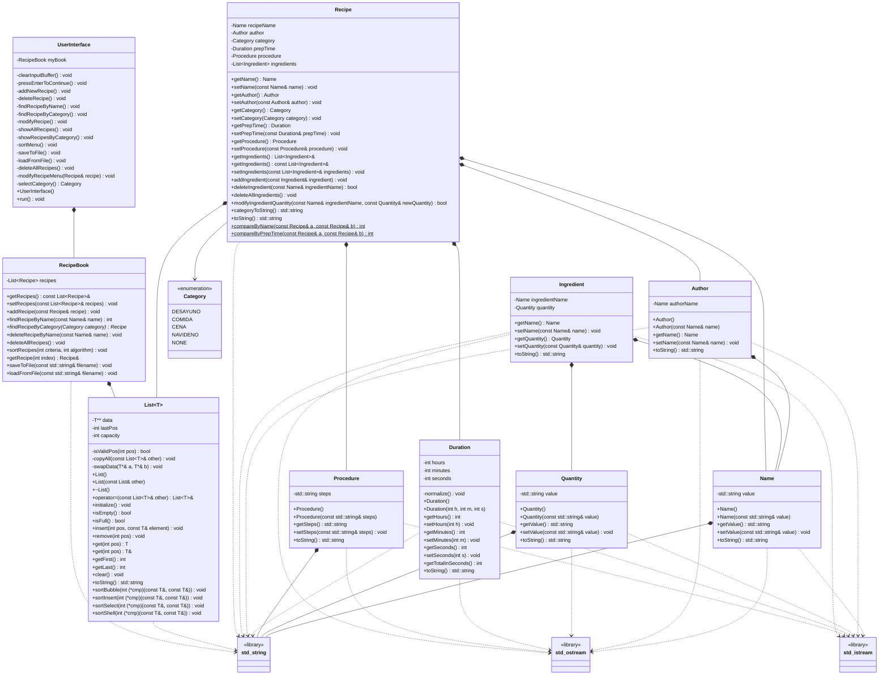

<div align="center">
  <svg width="200" height="100" xmlns="http://www.w3.org/2000/svg">
    <rect x="10" y="10" width="180" height="80" rx="20" ry="20" style="fill: #FFD1DC; stroke: #FFB6C1; stroke-width: 2;"/>
    <text x="50%" y="50%" dominant-baseline="middle" text-anchor="middle" style="font-family: 'Comic Sans MS', cursive, sans-serif; font-size: 24px; fill: #FFFFFF;">Recetario</text>
    <text x="50%" y="75%" dominant-baseline="middle" text-anchor="middle" style="font-family: 'Comic Sans MS', cursive, sans-serif; font-size: 14px; fill: #FFFFFF;">Hecho con ♡</text>
  </svg>
</div>

<h1 align="center" style="color: #FFB6C1;">
  Mi Recetario Mágico 🍳✨
</h1>
<p align="center" style="color: #FFB6C1;">
  <i>Tu pequeño asistente de cocina para guardar y organizar todas tus recetas favoritas.</i>
</p>

<p align="center">
  
  
  
  
</p>

---

### 🎀 Presentación Amable

Es una aplicación de consola súper fácil de usar, desarrollada en C++, que te permite:
- **Añadir** nuevas recetas.
- **Guardar** todos los detalles: ingredientes, tiempo de preparación, autor y los pasos a seguir.
- **Organizar** tus platillos por categorías como desayuno, comida, cena y ¡hasta recetas navideñas!
- **Buscar, modificar y eliminar** recetas cuando lo necesites.
- **Guardar y cargar** tu colección completa desde un archivo.

---

### 🎨 Paleta Tecnológica

Este proyecto fue creado con utilizando las siguientes herramientas:

<div align="center">
  
  
  
</div>

---

### ✨ Joyas del Proyecto

- **🍰 Gestión Completa de Recetas:** Añade, elimina y modifica recetas con todos sus detalles.
- **👩‍🍳 Autor y Categorías:** Asigna un autor a cada receta y clasifícalas para una mejor organización.
- **📜 Listas Dinámicas:** Utiliza una clase `List` genérica para manejar colecciones de recetas e ingredientes.
- **💾 Persistencia de Datos:** Guarda todo tu recetario en un archivo de texto (`recetas.txt`) y cárgalo al iniciar.
- **🔍 Búsqueda Inteligente:** Encuentra recetas por nombre o por categoría de forma rápida y sencilla.
- **🔢 Algoritmos de Ordenamiento:** Ordena tu recetario por nombre o tiempo de preparación usando algoritmos como Burbuja, Inserción, Selección o Shell.
- **🎀 Interfaz de Usuario Amigable:** Menú de consola claro e intuitivo para interactuar con todas las funciones.

---

### 🛠️ Guía de Instalación y Uso

¡Poner en marcha este recetario es súper fácil! Solo sigue estos pasitos:

1.  **Clona el Repositorio:**
    ```bash
    git clone [https://github.com/tu-usuario/tu-repositorio.git](https://github.com/tu-usuario/tu-repositorio.git)
    cd tu-repositorio
    ```

2.  **Compila el Proyecto:**
    Abre tu terminal en la carpeta `preliminar` y usa el `Makefile` incluido.
    ```bash
    make
    ```
    Esto compilará todo el código fuente y creará un ejecutable en la carpeta `output`.

3.  **¡Ejecuta la Aplicación!**
    ```bash
    ./output/main.exe
    ```

4.  **Disfruta tu Recetario:**
    ¡Y listo! Se desplegará un menú interactivo en tu consola para que comiences a añadir tus recetas.

---

### 🖼️ Galería Visual

<details>
  <summary style="cursor: pointer; color: #FFB6C1;"><strong>💖 ¡Haz clic para ver cómo luce la app! 💖</strong></summary>
  <br>
  <p align="center">
    <i>Aquí puedes añadir capturas de pantalla del menú principal, la vista de una receta, el proceso de añadir un ingrediente, ¡y más!</i>
    <br><br>
    </p>
</details>

---

### 🏛️ Diagrama de Arquitectura (UML)

Aquí tienes un vistazo a cómo se conectan todas las piezas de este proyecto.


